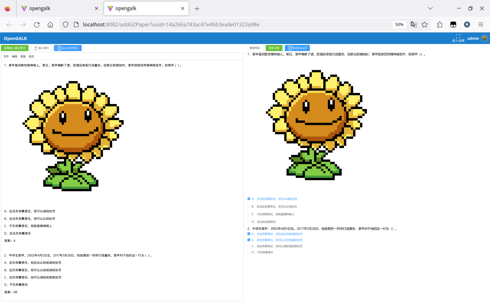

<div align="center"><h3>开源公安联考机考web版系统</h3></div>

<div align="center">
<a href='https://gitee.com/xiangrikuicx/opengalk/stargazers'></img></a>
<a href='https://gitee.com/xiangrikuicx/opengalk/members'></img></a>  
</div>

### SpringBoot3 + Vue3前后端分离项目
本篇README.md面向开发者

## 目录
- [概览](#概览)
- [功能实现](#功能实现)
- [上手指南](#上手指南)
    - [开发前的配置要求](#开发前的配置要求)
    - [文件目录说明](#文件目录说明)
- [安装和部署](#安装和部署)
- [使用到的框架](#本项目使用到的框架)
- [版本控制](#版本控制)
    - [如何参与开源项目](#如何参与开源项目)
- [作者](#作者)
- [鸣谢](#鸣谢)
## 概览

用户中心

用户管理

试卷管理

添加试卷

模拟考试

公专考试页面


## 功能实现

### 已实现

- 简易登陆注册
- 用户管理
- 学校管理
- 试卷管理
- 个人设置
- 公安专业科目考试
- 上传带图片的题目（很多bug，待完善）

### 待实现

- 上传带图片的选项
- 从word导入题目
- 将试卷导出为word
- 分模块练习
- 讨论区
- 个人设置（每日记录）
- 行政职业能力测试考试
- 首页内容

    。。。更多待实现功能

## 上手指南

### 开发前的配置要求

1. 尽量使用Intellij idea开发工具
2. jdk17版本及以上jdk
3. pnpm包管理
4. 非IE 11版本以下浏览器
5. postgres数据库
6. redis缓存数据库

### 文件目录说明

```
opengalk
├── LICENSE 许可
├── README.md 说明文档
├── readme_imgs 说明文档图片
├── opengalk.iml idea导入模块配置文件
├── opengalk-webui.iml idea导入模块配置文件
├── opengalk.sql postgres数据库数据
├── opengalk-server 服务端
├── opengalk-webui webui端
```

## 安装和部署

1. 克隆项目
    ```shell
    git clone https://gitee.com/xiangrikuicx/opengalk.git
    ```
    
    ```shell
    cd opengalk
    ```
2. 安装并开启postgres数据库（5432端口），使用psql导入数据
      1. 登录postgres
          ```shell
          sudo -u postgres psql
          ```
      2. 修改登录postgres密码为123456
          ```postgresql
          alter role postgres with password '123456'
          ```
      3. 创建数据库
          ```postgresql
          create database opengalk
          ```
      4. 使用psql导入数据
          ```shell
          psql -d opengalk -U postgres -f opengalk.sql
          ```
         
3. 使用idea打开本项目下载依赖

    - 使用gradle管理java依赖

    - 使用pnpm管理vue依赖

4. 开启redis（6379端口）
5. 启动项目之后的管理

    登陆地址：http://localhost:8082

    管理员账号：admin

    密码：123456

## 本项目使用到的框架

- [Spring Boot](https://spring.io/projects/spring-boot/)
- [Spring Security](https://spring.io/projects/spring-security)
- [MyBatis Plus](https://baomidou.com)
- [Vue](https://cn.vuejs.org/)
- [Element Plus](https://element-plus.org/zh-CN/)

## 版本控制

该项目使用Git进行版本管理。
### 如何参与开源项目

贡献使开源社区成为一个学习、激励和创造的绝佳场所。你所作的任何贡献都是**非常感谢**的。

1. fork 该仓库
2. 创建并切换到新分支(`git checkout -b develop/xxxxx`)
3. 提交 (`git commit -m "yyyyyy"`)
4. 推送 (`git push origin develop/xxxxx`)
5. 打开pull request

## 作者

cx

*您也可以在贡献者名单中参看所有参与该项目的开发者。*

## 版权说明

该项目签署了木兰宽松许可证， 第2版授权许可，详情请参阅 [LICENSE](http://license.coscl.org.cn/MulanPSL2)

## 鸣谢
